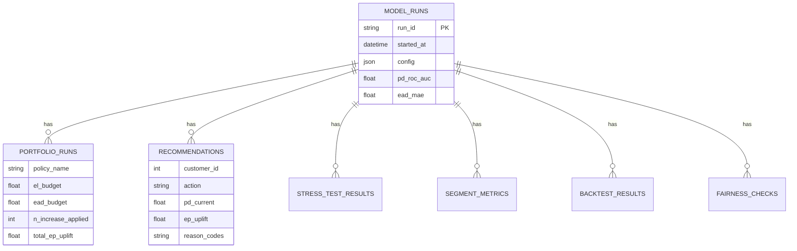

# Credit Line Manager

A credit decisioning & portfolio analytics platform: predicts default risk (PD) and exposure (EAD) per customer, recommends a profit-maximizing credit limit under portfolio-level risk budgets, explains every decision with SHAP-based reason codes, and stress-tests the resulting portfolio — with a full run-history database, a scoring/analytics API, and a React dashboard on top.

Built on the [UCI Credit Card Default dataset](https://archive.ics.uci.edu/ml/datasets/default+of+credit+card+clients) (30,000 customers, Taiwan, 2005).

## Architecture

```
                    ┌──────────────────────────────────────────┐
                    │  ML / Decisioning Pipeline (run_all.py)    │
                    │  data_prep → features → PD/EAD (XGBoost)   │
                    │  → decision_engine (counterfactual + EP)   │
                    │  → explainability (SHAP) → portfolio_opt   │
                    │  → stress_test → archive_run                │
                    └───────────────────┬────────────────────────┘
                                         │  data/processed/runs/<run_id>/
                    ┌────────────────────▼───────────────────────┐
                    │  Analytics (run_analytics.py)                │
                    │  segments · fairness check · cutoff backtest │
                    │  · policy comparison                          │
                    └───────────────────┬────────────────────────┘
                                         │  sync_run_to_db.py
                    ┌────────────────────▼───────────────────────┐
                    │  PostgreSQL  (src/db/, alembic/)              │
                    │  model_runs → portfolio_runs, recommendations,│
                    │  stress_test_results, segment_metrics, ...    │
                    └───────────────────┬────────────────────────┘
                                         │
                    ┌────────────────────▼───────────────────────┐
                    │  FastAPI  (src/api/)                          │
                    │  run history · live scoring · trigger runs    │
                    └───────────────────┬────────────────────────┘
                                         │
                    ┌────────────────────▼───────────────────────┐
                    │  React + TypeScript frontend (frontend/)      │
                    │  Runs · Action Queue · Customer Lookup        │
                    └──────────────────────────────────────────────┘
```

Every stage above was added because the stage before it hit a real limit, not speculatively — see `CLAUDE.md` for the full reasoning per layer (e.g. Postgres exists because the pipeline used to overwrite its own audit trail on every run).

## Data model (core tables)



`PORTFOLIO_RUNS` is one-to-many per run because a single trained model can be evaluated under several policies (tighter/looser guardrails, different budgets) — see `reports/analytics_findings.md` §4 for what that comparison found. Full schema: `src/db/models.py`.

## Results (latest run)

| Metric | Value |
|---|---|
| PD model ROC-AUC (val) | 0.780 |
| PD model PR-AUC (val) | 0.560 |
| Brier score, raw → calibrated | 0.174 → 0.134 |
| EAD model MAE | 757 |
| Limits increased / decreased | 4,002 / 22,511 |
| Total EP uplift (approved plan) | ~$43.9M |
| EAD budget utilization | 77% |

Full report: `reports/pipeline_metrics.txt`. Segment/fairness/backtest/policy-comparison findings, including a genuine bug this analysis caught (see below): `reports/analytics_findings.md`.

## Known limitations (stated, not hidden)

- **The counterfactual PD is a correlation, not a causal estimate.** Raising a limit lowers utilization, and the PD model reads low utilization as materially lower risk — so counterfactual PD tends to drop sharply whenever a limit is raised, which is why the EL budget rarely binds. A real fix means damping how much PD is allowed to move from a limit change alone; documented, not yet fixed.
- **`SEX`/`EDUCATION`/`MARRIAGE` are fed to the PD model as raw numeric features.** A fair-lending review flagged `marriage_segment` below the conventional four-fifths threshold (see `reports/analytics_findings.md` §2). The fix is not training on protected characteristics, not just monitoring the ratio.
- **The in-memory background-job registry** (`src/api/jobs.py`) and **the fast Policy-Simulator approximation** in the (now-removed) Streamlit prototype were both deliberate single-instance simplifications — documented in `CLAUDE.md`, not silently scaled up without the caveat.

## Quickstart

```bash
git clone https://github.com/lakshya1907/credit-line-manager.git
cd credit-line-manager
python3 -m venv venv && source venv/bin/activate
pip install -r requirements-dev.txt

python run_all.py                 # trains models, produces recommendations (~10s)

createdb credit_line_manager
alembic upgrade head
python sync_run_to_db.py          # load that run into Postgres

uvicorn src.api.app:app --reload  # API on :8000
cd frontend && npm install && npm run dev   # frontend, separate terminal
```

Or the containerized version:

```bash
docker-compose up --build
docker-compose exec api python run_all.py
docker-compose exec api python sync_run_to_db.py
```

Full command reference, every module's design rationale, and the "what broke and how it was actually verified" history: **`CLAUDE.md`**. Frontend-specific notes: `frontend/README.md`.

## Testing

```bash
pytest        # 114 tests: pure-function unit tests, ORM/DB tests (SQLite-portable),
              # API tests (TestClient), auth/logging tests -- no real model training
```

CI (`.github/workflows/ci.yml`) runs this against a real Postgres service container on every push, plus a frontend type-check + build. Several fixes in this project's history were caught by writing a regression test, reverting the fix, and confirming the test actually failed against the old code — not just written to pass; see `CLAUDE.md`'s Testing section for which ones.

## Tech stack

**ML**: XGBoost (PD classifier + EAD regressor), scikit-learn (calibration, splits), SHAP (explainability) — vectorized end-to-end (a full 30k-customer decision-engine run: ~0.3s, down from ~10 minutes before batching model calls).
**Data**: pandas, numpy, pyarrow.
**Backend**: PostgreSQL, SQLAlchemy 2.x, Alembic, FastAPI.
**Frontend**: React, TypeScript, Vite, TanStack Query/Table, Recharts, Tailwind CSS v4.
**Infra**: Docker Compose, GitHub Actions.

## Project structure

```
credit-line-manager/
├── run_all.py, run_analytics.py, sync_run_to_db.py   # pipeline entrypoints
├── src/
│   ├── data_prep.py, features.py, pd_model.py, ead_model.py, calibrate.py
│   ├── decision_engine.py, counterfactual.py, economics.py, portfolio_opt.py
│   ├── stress_test.py, explainability.py
│   ├── analytics/       # segments, backtest, policy_compare
│   ├── db/               # SQLAlchemy models, session
│   └── api/              # FastAPI app, routers, auth, logging
├── alembic/               # DB migrations
├── frontend/              # React + TypeScript SPA
├── tests/                 # pytest, 114 tests
├── data/raw/               # input dataset
└── Dockerfile, frontend/Dockerfile, docker-compose.yml
```

## Authors

- **Manya Chawla** — 24/IT/113, Delhi Technological University
- **Lakshya Jindal** — 24/IT/100, Delhi Technological University

## References

- Hand, D.J. & Henley, W.E. (1997). Statistical classification methods in consumer credit scoring.
- Yeh, I.C. & Lien, C.H. (2009). The comparisons of data mining techniques.
- Lessmann, S. et al. (2015). Benchmarking state-of-the-art classification algorithms for credit scoring.
- Sohn, S.Y. et al. (2014). Optimization-based credit limit management.
